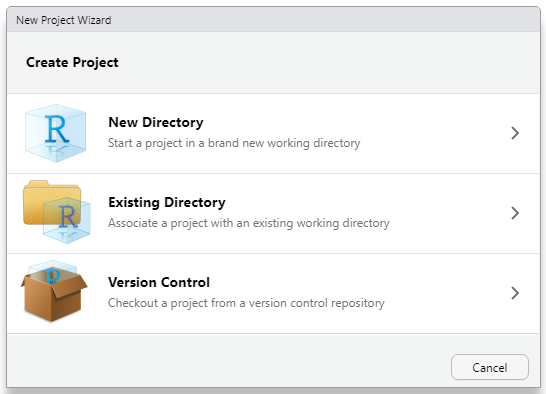
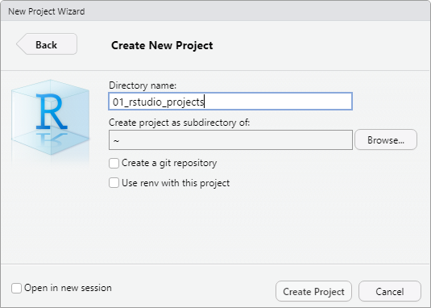

class: middle, center, inverse

# 2 Introduction to RStudio Projects

---

background-image: url(https://cdn.fileinfo.com/img/icons/files/128/rproj-10013.png)
background-position: 95% 5%
background-size: 7.5%
layout: true


---

## 2 Introduction to RStudio Projects (`.Rproj`)

**What is an RStudio project?**<br>
RStudio projects offer you a way to structure your data science project and improve your workflow:

- Keep all the files related to your data science project in a single place.
- Stop working on one or multiple `R scripts` and return later to continue where you left.
- Structure your project or analysis in a modular manner.
- Easily share your whole project with collaborators.

--

.pull-left[
**How do I create an RStudio project?**<br>
RStudio provides three ways of creating an `.Rproj` (*File* -> *New Project...*):
1. As a new file directory
2. As part of an existing file directory
3. By cloning a version control repository (e.g., from GitHub)
]
.pull-right[
```{r, echo=F, out.height='70%', out.width='70%', fig.align='center'}

```
]

???
comment

---

name: create-project

## 2 Introduction to RStudio Projects (`.Rproj`)

Here, I am creating a brand new directory, called `01_structuring_data_projects` in which I create this presentation:

```{r, echo=F, out.height='50%', out.width='50%', fig.align='center'}

```

???
use renv with this project

---

## 2 Introduction to RStudio Projects (`.Rproj`)

**What happens when a new project is created?**
- RStudio creates a `.Rproj` file within the specified directory. This file contains certain project options and enables to open the RStudio project from your machine's filesystem.
- RStudio creates a hidden directory (`.Rproj.user`) where project-related temporary files (e.g. auto-saved  documents) are stored.
- RStudio loads the `.Rproj` file and displays the project name on the far right side of the main toolbar.

--
<br><br>

**What happens when a new RStudio Project is opened?**
- A fresh `R` session is started.
- The `.RData` file in the project directory is loaded (depending on the project options).
- The `.Rhistory` file in the project directory is loaded into the *RStudio history pane*.
- Previously edited scripts are restored.
- The current *working directory* is set to the project directory (as previously specified, see [slide 6](#create-project)).
- ...

???
comments

---

## 2 Introduction to RStudio Projects (`.Rproj`)

Let's have a look at the project directory for this presentation (maintained as an `.Rproj`):
```{r, eval=F}
abs_path <- getwd()
abs_path
```
```
> [1] "C:/Users/.../workshops/01_structuring_data_projects"
```
<br>
This path is referred to as an **absolute path**. What files do we find under this path?
```{r, eval=F}
dir(abs_path)
```
```
>  [1] "01_rstudio_projects.Rmd"         "02_r_notebooks.Rmd"              "03_project_environments.Rmd"    
>  [4] "custom"                          "demo"                            "img"                            
>  [7] "index.html"                      "index.Rmd"                       "libs"                           
> [10] "README.md"                       "renv"                            "renv.lock"                      
> [13] "slides"                          "structuring_data_projects.Rproj"
```

This is basically all the stuff required for rendering this presentation. Put differently: With an `.Rproj`, I organize all the files related to the project in one folder (e.g., script files, data sets, figures, manuscripts, etc.).

???
comment

---

## 2 Introduction to RStudio Projects (`.Rproj`)

Instead of using `dir(abs_path)`, you may also use `dir(".")`. When specifying a path on your computer, the single dot ( `.` ) reflects a **relative path**, i.e. a path relative to your current working directory. Hence, it again refers to:
```
> [1] "C:/Users/.../workshops/01_structuring_data_projects"
```
<br>
Now, let's assume you want to access `data.txt` in the subfolder `data`, i.e. you search for this file under:
```
> [1] "C:/Users/.../workshops/01_structuring_data_projects/data"
```
What is the corresponding relative path when reading in the data?
```{r, warning=F, eval=F}
read.delim("./data/data.txt", header = T, sep = ",")
```
The use of relative paths makes it very easy to navigate your project or share it with collaborators without having to adjust every path manually!

.footnote[
*Note: If you want to step one folder up in the folder hierarchy, you may use two dots ( `..` ). When writing paths on Windows, use `/` instead of `\` , otherwise `R` interprets it as an escape character.*
]

???
comment

---

## 2 Introduction to RStudio Projects (`.Rproj`)
<br>
```{r, echo=F, out.height='50%', out.width='50%', fig.align='center'}
knitr::include_graphics("https://media1.tenor.com/images/f72cb542d6b3e3c3421889e0a3d9628d/tenor.gif")
```

???
comment

---

## 2 Introduction to RStudio Projects (`.Rproj`)

**Project options:** Access project options within RStudio by navigating to *Tools -> Project Options...* .

- **Save workspace to `.RData` on exit:** Stores your current `global environment` (workspace) in an `.RData`-file in your project directory when closing your RStudio project.<br><br>
*Note: Not recommended! You should always be able to recreate your global environment from your scripts. Hence, I would set this behavior of Rstudio to "never" (Tools -> Global Options...).*<br><br>
- **Restore `.RData` into workspace at startup:** Loads your previously saved workspace from the `.RData` file into the `global environment`.<br><br>
- **Always save history:** Writes your code history (see history pane) into an `.Rhistory` file located in your project directory.

???
comment
