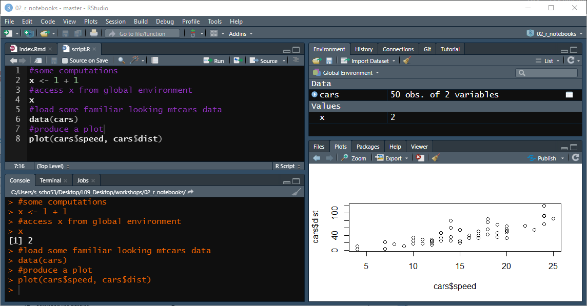
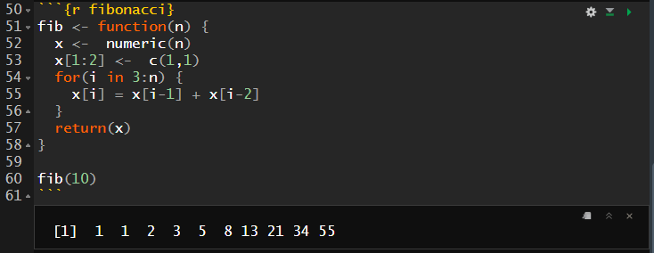

layout: true

---

class: middle, center, inverse

# 3 R Markdown Documents

---

## 3 The Story So Far: R Scripts (**`.R`**)

```{r, echo=F, out.height='65%', out.width='65%', fig.align='center'}

```

--

With R scripts (`.R`), a report of your analysis must be drawn separately from your code (e.g., in MS Word) while collecting all plots and results you have previously written to file (e.g., `.PNG` or `.csv`). More importantly, each change of the code requires a whole review of the report! `r emo::ji("weary")`

???
- file extension `.R`
- top right: see the name of the opened RStudio project
- explain the different panes
- a script is really just plain R code, maybe annotated by comments
- the code is executed by sending it from the editor pane to the console
- output is either shown in the console or in plot/viewer pane
- send the whole code to console or just chunks
- not really a good approach because you are going back and forth between console and script the whole time
- and what does this workflow look like if you have to write a report based on your code (e.g., your thesis)?
- <click>

---

background-image: url(https://camo.githubusercontent.com/de0519dd8e4ebc982eb0ddfaa9c6cd0924149e6c/68747470733a2f2f626f6f6b646f776e2e6f72672f79696875692f726d61726b646f776e2f696d616765732f6865782d726d61726b646f776e2e706e67)
background-position: 95% 5%
background-size: 7.5%
layout: true

---

## 3 R Markdown Documents (`.Rmd`)

.pull-left[
**The `rmarkdown` package:**
- Markdown-based authoring framework for data science
- Intertwine `R` code and plain text in one document
- Generate high-quality reports from `.Rmd`-files

**Document elements:**
- Header
- Text body
- Code & output
]
.pull-right[
<iframe src="https://player.vimeo.com/video/178485416?color=428bca" width="640" height="400" frameborder="0" allow="autoplay; fullscreen" allowfullscreen></iframe>
<p><a href="https://vimeo.com/178485416">What is R Markdown?</a> from <a href="https://vimeo.com/rstudioinc">RStudio, Inc.</a> on <a href="https://vimeo.com">Vimeo</a>.</p>
]

.footnote[
.pull-left[
*Note: The different document elements apply to R Markdown Documents (`.Rmd`-files) and do not appear in common R Scripts (`.R`-files)*.
]]

???
show video on sec 16

---

## 3 R Markdown Documents (`.Rmd`)
### 3.1 The Header

The **`YAML` header** appears at the top of each `.Rmd` document. It contains a bunch of metadata as well as formatting options for your final report. The syntax for the header is based on [YAML](https://en.wikipedia.org/wiki/YAML).

```
 ---
 title: "Rmarkdown Demo"    #Title/headline of your markdown report
 author: John Doe           #Name of the author
 date: 2020-11-02           #Date of the report
 output:                    #YAML options specifying the output
   html_document:               #Output format
     toc: true                  #Table of contents (toc)
     toc_float: true            #Floating toc on the left side of the document
     toc_depth: 2               #Depth of headers to generate toc
 ---
```

???
YAML: "YAML Ain't Markup Language"
Only a small extract of options you can specify as part of the YAML header.

---

## 3 R Markdown Documents (`.Rmd`)
### 3.2 The Text Body

.pull-left[
```
You can write plain text,
```
```
in *italics* or in **bold**,
```
```
and use S^uperscript^ or S~ubscript~.
```
```
You can format text as `fancy R code`,
```
```
and even embed LaTeX equations:

$$
x_{1/2} = -\frac{p}{2}\pm \sqrt{(\frac{p}{2})^2-q}
$$
```
]
.pull-right[
You can write plain text,

in *italics* or in **bold**,

and use S<sup>uperscript</sup> or S<sub>ubscript</sub>.

You can format text as `fancy R code`,

and even embed LaTeX equations:
.pull-left[
$$
x_{1/2} = -\frac{p}{2}\pm \sqrt{(\frac{p}{2})^2-q} 
$$
]]

---

## 3 R Markdown Documents (`.Rmd`)
### 3.2 The Text Body

```
# You can use headers (H1)
```
# You can use headers (H1)
```
## You can use headers (H2)
```
## You can use headers (H2)
```
### You can use headers (H3)
```
### You can use headers (H3)

???
all the way down to level H6

---

## 3 R Markdown Documents (`.Rmd`)
### 3.2 The Text Body

.pull-left[
```
> You can highlight quotes,
```
> You can highlight quotes,

<br><br><br>
```
embed [Hyperlinks](url),
```
embed [Hyperlinks](https://raw.githubusercontent.com/rstudio/cheatsheets/master/rmarkdown-2.0.pdf),
]
.pull-right[
```
or include images: .
``` 
or include images:

.
]

???
comments

---

## 3 R Markdown Documents (`.Rmd`)
### 3.2 The Text Body

.pull-left[
``` 
- You can
- create
  - an unordered
  - list
    - of items
```

``` 
1. Or even
2. better
3. you create an ordered list
  1. which should
  2. also look
    1. familiar!
```
]
.pull-right[

And finally, since we are in an academic context you might also want to use some footnotes.[^1]

```
[^1]: *Note: Find more information about the
`rmarkdown` syntax by consulting the official
[cheat sheet](url).*
```

<br><br>

And finally, since we are in an academic context you might also want to use some footnotes.<sup>1</sup>

.footnote[
[1] Note: Find more information about the `rmarkdown` syntax by consulting the official [cheat sheet](https://raw.githubusercontent.com/rstudio/cheatsheets/master/rmarkdown-2.0.pdf).
]]

???
Point to the value of cheat sheets!

---

## 3 R Markdown Documents (`.Rmd`)
### 3.3 Code Chunks & Output

**Code Chunks:** Self-contained part of your `R` code for which, upon code evaluation, the output of your code is shown directly below the chunk instead of in your console or the *RStudio viewer* or the *plots pane*.

```{r, echo=F, out.height='65%', out.width='65%', out.extra='style="float:left; padding:10px"'}

```
<br>
**Creating code chunks**:  
Using the *insert* button in the RStudio interface , or via the keyboard shortcut:<br>*Ctrl + Alt + I*.

*Note: In fact, code chunks even allow you to write and evaluate code in other languages, such as Python, SQL or C++.*

???
The code is send from the chunk to your console where it is evaluated. The output is then send back to your code chunk where it is displayed below.

Note:
- each chunk is surrounded by three tick-marks (at start and end)
- first word in curved bracket indicates computational engine
- second word gives a name to code chunks for referencing

---

## 3 R Markdown Documents (`.Rmd`)
### 3.3 Live Demo

.center[
```{r, echo=F}
countdown::countdown(
  minutes = 2, seconds = 0, 
  left = 0, right = 0, top = 0.5, bottom = 0.5,
  padding = "50px",
  margin = "7.5%",
  font_size = "5em"
)
```
]

???
show little green bar, talk about chunk names and chunk options, explain how code is sent to console and back, run inline expressions (cmd + enter)

---

## 3 R Markdown Documents (`.Rmd`)
### 3.3 Code Chunks & Output

**Chunk Options:** Can be (mostly) set as boolean (**`T`**`rue`/**`F`**`alse`) arguments in the chunk header `{r ...}`.
```{r, echo=F}
df <- data.frame(
  Argument = c('include=F', 'eval=F', 'results="hide"', 'echo=F', 'message=F', 'warning=F'),
  Description = c(
    'Code and Output does not appear in the final report (yet, code is still evaluated).',
    'Output does not appear in the final report as the code is not evaluated.',
    'Output does not appear in the final report but the code is evaluated.',
    'Code does not appear in the final report.',
    'Messages generated by the code do not appear in the final report.',
    'Warnings generated by the code do not appear in the final report.')
)

knitr::kable(df, format = "html", table.attr = "style='width:100%;'")
```

---

## 3 R Markdown Documents (`.Rmd`)
### 3.4 Generating High-Quality Reports

Render the `.Rmd` document into your desired output format by using `knitr::render()` command from the `knitr` package or hit the *Knit* button in your RStudio toolbar.

--

```{r, echo=F, out.height='50%', out.width='50%', fig.align='center'}
knitr::include_graphics("https://d33wubrfki0l68.cloudfront.net/61d189fd9cdf955058415d3e1b28dd60e1bd7c9b/b739c/lesson-images/rmarkdownflow.png")
```
<br><br>
**Workflow in the background:**

1. `knitr` takes your `.Rmd`-file and converts it into a plain markdown file (`.md`).
2. The `.md`-file is processed by `pandoc` and converted into the final output format (e.g., PDF, HTML, Word).

*Note: `knitr` can only convert your final `.Rmd`-file if your code is free of errors as `knitr` tries to run your entire code (so-called batch execution) as part of the conversion workflow!*

---

## 3 R Markdown Documents (`.Rmd`)

```{r, echo=F, out.height='70%', out.width='70%', fig.align='center'}
knitr::include_graphics("https://raw.githubusercontent.com/allisonhorst/stats-illustrations/master/rstats-artwork/rmarkdown_wizards.png")
```

---

layout: false

class: middle, center, inverse

# 4 Interactive Data Science

---

background-image: url(https://camo.githubusercontent.com/de0519dd8e4ebc982eb0ddfaa9c6cd0924149e6c/68747470733a2f2f626f6f6b646f776e2e6f72672f79696875692f726d61726b646f776e2f696d616765732f6865782d726d61726b646f776e2e706e67)
background-position: 95% 5%
background-size: 7.5%
layout: true

---

## 4 Interactive Data Science 
### 4.1 Introduction to Computational Notebooks

**Computational notebooks** are virtual interfaces used for [Literate Programming](https://en.wikipedia.org/wiki/Literate_programming). They combine features of word processors (e.g., MS Word) and the programming language kernel (e.g., the R shell which you find in the *RStudio console pane*).

--

.pull-left[
**Features:**
- Interactivity
- Iteration
- Sharing & Communication
- Transparency
- Reproducibility
]
.pull-right[
.pull-left[
```{r, echo=F, out.height='80%', out.width='80%'}
knitr::include_graphics("https://upload.wikimedia.org/wikipedia/commons/thumb/3/38/Jupyter_logo.svg/518px-Jupyter_logo.svg.png")
```
]
.pull-right[
```{r, echo=F, out.height='100%', out.width='100%'}
knitr::include_graphics("https://www.r-project.org/logo/Rlogo.svg")
```
]]

???
Literate Programming:
- Writing human-readable computer programs
- Boils down to having the source code as well as natural language documentations in one file

Notebook Alternatives: Jupyter Notebook (language agnostic, but especially widespread in the Python area), R Notebook, Google Colab

---

## 4 Interactive Data Science 
### 4.1 Introduction to Computational Notebooks

.center[This sounds pretty familiar after learning about R Markdown documents right? <br> So what is the R Notebook all about?]
<br><br>
```{r, echo=F, out.height='40%', out.width='40%', fig.align='center'}
knitr::include_graphics("https://tenor.com/view/obama-wtf-why-president-wut-gif-12221156.gif")
```

???
comments

---

## 4 Interactive Data Science 
### 4.2 R Markdown Documents vs. R Notebooks

Primarily, both formats are based on `.Rmd`-files:
- An R Markdown document can be used as a computational notebook,
- and an R Notebook can be rendered to other R Markdown document types (e.g., PDF, HTML, Word).

A notebook (in the `R` universe) can be viewed as a special version of a Markdown document (it is a special way of executing an R Markdown document).

--

**The use case is determined by your goal:** generating high-quality reports with R Markdown documents vs. doing data science / machine learning using R Notebooks.

.pull-left[
**R Markdown documents:**
- Execution of the whole code before rendering (batch execution)
- Requires code to be free of errors
]
.pull-right[
**R Notebooks:**
- Preview is simply a snapshot of your notebook (see `.nb.html`-file)
- No `R` code is executed
]

???
First sentence: you will likely don't see any apparent differences between the two formats.

---

## 4 Interactive Data Science 
### 4.2 Live Demo

.center[
```{r, echo=F}
countdown::countdown(
  minutes = 2, seconds = 0, 
  left = 0, right = 0, top = 0.5, bottom = 0.5,
  padding = "50px",
  margin = "7.5%",
  font_size = "5em"
)
```
]

???
preview of .nb.html which updates every time the file is saved (simple html snapshot of your notebook and not a final report, i.e. R does not check that the whole output is free of error)

Highlight value of code chunks: split large code chunks or code chunks that generate more than one output into multiple chunks -> improve readability, transparency and user experience (also for your future self); also more easy to debug

!NOTE! This could never be rendered to PDF as an error occurs.
  